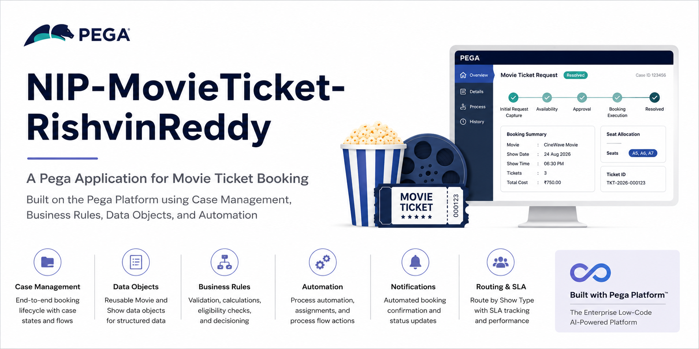

# NIP Movie Ticket Booking Management
A Pega-based Movie Ticket Booking Management application developed for the National Internship Program (NIP).

The application manages the complete movie ticket booking lifecycle, from submitting a booking request through availability validation, customer confirmation, booking execution, notification, and resolution.

---

## Project Information
| Field | Details |
|---|---|
| Project | Movie Ticket Booking Management |
| Application | `NIP-MovieTicket-RishvinReddy` |
| Case Type | `Movie Ticket Request` |
| Platform | Pega |
| Organization | CineWave Entertainment |
| Program | National Internship Program (NIP) |
| Developer | Rishvin Reddy |
| Project Status | Ready for Submission |

---

## 1. Project Overview
The **Movie Ticket Booking Management Application** provides a structured Pega case-management workflow for handling movie ticket booking requests.

The application brings together movie and show information, availability validation, booking calculations, customer approval, seat allocation, ticket processing, queue routing, SLA management, and customer notification into a single case lifecycle.

### Core capabilities
- Movie and Show data management
- Movie Ticket Request creation
- Show availability checking
- Seat availability validation
- Automatic Total Cost calculation
- Booking summary and review
- Customer confirmation
- Booking cancellation
- Seat allocation
- Ticket ID management
- Booking status management
- Booking confirmation status
- Show Type based routing
- SLA management
- Customer notification
- Dynamic booking correspondence
- Case completion and resolution

---

## 2. Business Objective
The objective of the application is to provide an automated and structured process for managing movie ticket bookings.

The solution allows the booking process to be handled through a Pega case lifecycle rather than through disconnected manual steps.

The application supports:

```text
Customer Request
      |
      v
Availability Validation
      |
      v
Booking Review
      |
      v
Customer Confirmation
      |
      v
Booking Execution
      |
      v
Customer Notification
      |
      v
Case Resolution
```

---

## 3. Case Type
The primary case type is:
`Movie Ticket Request`

Each case represents an individual movie ticket booking request.

**Case Lifecycle**
```text
Initial Request
      |
      v
Availability
      |
      v
Approval
      |
      v
Booking Execution
      |
      v
Customer Notification
      |
      v
Resolution
```

---

## 4. Functional Requirements
The application covers the ten NIP Movie Ticket Booking user stories.

| ID | Requirement | Status |
|---|---|---|
| US-001 | Submit Movie Ticket Request | Configured |
| US-002 | Check Show Availability | Configured |
| US-003 | Calculate Booking Cost | Configured |
| US-004 | Confirm Booking Request | Configured |
| US-005 | Maintain Movie and Show Data | Configured |
| US-006 | Review Booking Details | Configured |
| US-007 | Process Ticket Booking | Configured |
| US-008 | Notify Booking Confirmation | Configured |
| US-009 | Define Booking SLA | Configured |
| US-010 | Route Booking by Show Type | Configured |

Detailed requirements are documented in:
`docs/requirements.md`

---

## 5. Application Architecture
The application uses Pega case management and supporting rule components to implement the booking workflow.

**Major Components**

```text
Pega Application
│
├── Movie Ticket Request Case
│
├── Data Objects
│   ├── Movie
│   └── Show
│
├── Decision Tables
│   ├── ValidateSufficientSeats
│   └── ConfirmBooking
│
├── Data Transforms
│   ├── CaptureSeatCount
│   ├── CheckSeatStatus
│   └── PrepareBookingSummary
│
├── Declare Expressions
│   ├── CalculateTotalCost
│   └── AvailableSeatsCount
│
├── Work Queues
│   ├── PremiumShowQueue
│   └── StandardShowQueue
│
├── SLA
│   ├── Goal: 1 day
│   └── Deadline: 2 days
│
└── Correspondence
    └── Booking Confirmation
```

Detailed architecture information:
`docs/architecture.md`

---

## 6. Data Model

**Movie**
The Movie data object contains:
- Movie Name
- Genre

**Show**
The Show data object contains:
- Movie
- Show Date
- Show Time
- Seat Capacity

**Movie Ticket Request**
The case maintains booking information including:
- Movie Data Reference
- Show Data Reference
- Number of Tickets
- Ticket Price
- Total Cost
- Available Seats Count
- Seat Availability Status
- Booking Confirmation Status
- Booking Status
- Seat Numbers
- Ticket ID
- Show Type

Detailed data-model documentation:
`docs/data-model.md`

---

## 7. Business Rules

**Total Cost Calculation**
The booking cost is calculated automatically:
`Total Cost = Ticket Price × Number of Tickets`

Example:
Ticket Price = 250
Number of Tickets = 3
Total Cost = 750

**Seat Availability**
The application validates the requested number of tickets against the available seat count.

Primary Decision Table:
`ValidateSufficientSeats`

**Booking Confirmation**
The booking confirmation logic evaluates:
`Customer Confirmation + Seat Availability Status`

Configured outcomes include:
- Confirmed
- Cancelled
- Rejected
- Pending

Primary Decision Table:
`ConfirmBooking`

Detailed business-rule documentation:
`docs/business-rules.md`

---

## 8. Show Type Routing
The application automatically routes cases according to Show Type.

**Premium**
```text
ShowType = Premium
        |
        v
PremiumShowQueue
```

**Special Screening**
```text
ShowType = Special Screening
        |
        v
PremiumShowQueue
```

**Standard**
```text
ShowType = Standard
        |
        v
StandardShowQueue
```

**Other**
```text
Other Show Type
        |
        v
StandardShowQueue
```

This provides differentiated routing for premium and standard bookings.

---

## 9. SLA
The Movie Ticket Request case uses the configured SLA:

| Component | Configuration |
|---|---|
| Goal | 1 day |
| Deadline | 2 days |

Configured behavior includes:
* Goal-missed warning/flagging
* Deadline handling
* Automatic priority increase when the deadline is missed

---

## 10. Customer Notification
After successful booking completion, the application uses the configured notification flow:

```text
Booking Notification
        |
        v
Customer Notification
        |
        v
Send Booking Details
```

The booking correspondence dynamically displays:
* Case ID
* Movie Name
* Show Date and Time
* Number of Tickets
* Seat Numbers
* Total Cost

---

## 11. Testing
Functional verification has been completed for the implemented Movie Ticket Request functionality.

**Test Summary**

| Metric | Result |
|---|---|
| Test Cases | 33 |
| Configured / Verified | 33 |
| Failed | 0 |
| Blocked | 0 |
| Overall Result | PASS |

Testing covers:
* Movie data
* Show data
* Case data references
* Request submission
* Availability
* Seat validation
* Booking summary
* Customer confirmation
* Cancellation
* Seat allocation
* Booking status
* Ticket ID
* Seat Numbers
* Queue routing
* SLA
* Notification
* Correspondence
* Case completion
* Regression handling

Detailed test cases:
`testing/test-cases.md`

Test strategy:
`testing/test-plan.md`

Test execution results:
`testing/test-results.md`

---

## 12. Defect Resolution
During development, the application encountered a numeric range processing error:
`java.lang.NumberFormatException: For input string: "1 to 10"`

The issue was associated with the numeric range configuration in:
`ValidateSufficientSeats`

The Number of Tickets property was verified as an Integer.
The Decision Table configuration was corrected so that numeric ranges are evaluated using appropriate numeric range/operator logic rather than treating the complete range expression as a numeric value.

**Defect Status**
- **DEF-001**
- NumberFormatException for "1 to 10"
- **Status:** Resolved
- **Regression:** PASS

Detailed defect record:
`testing/defects/number-format-exception.md`

---

## 13. Repository Structure

```text
NIP-MovieTicket-RishvinReddy/
│
├── README.md
│
├── docs/
│   ├── project-overview.md
│   ├── requirements.md
│   ├── architecture.md
│   ├── case-lifecycle.md
│   ├── data-model.md
│   ├── business-rules.md
│   └── troubleshooting.md
│
├── testing/
│   ├── test-plan.md
│   ├── test-cases.md
│   ├── test-results.md
│   │
│   └── defects/
│       └── number-format-exception.md
│
└── submission/
    └── README.md
```

---

## 14. Documentation Guide

**Project Documentation**

| File | Purpose |
|---|---|
| `docs/project-overview.md` | Project purpose, scope, users, and features |
| `docs/requirements.md` | Functional requirements and user stories |
| `docs/architecture.md` | Application architecture and components |
| `docs/case-lifecycle.md` | Complete Movie Ticket Request lifecycle |
| `docs/data-model.md` | Data objects and case properties |
| `docs/business-rules.md` | Decision Tables and business automation |
| `docs/troubleshooting.md` | Development issues and troubleshooting |

**Testing Documentation**

| File | Purpose |
|---|---|
| `testing/test-plan.md` | Testing strategy and scope |
| `testing/test-cases.md` | Detailed functional test cases |
| `testing/test-results.md` | Completed test verification |
| `testing/defects/number-format-exception.md` | Defect analysis and resolution |

**Submission Documentation**

| File | Purpose |
|---|---|
| `submission/README.md` | NIP submission-facing project information |

---

## 15. End-to-End Booking Flow
A successful booking follows this general process:

```text
                    +----------------------+
                    | Movie Ticket Request |
                    +----------+-----------+
                               |
                               v
                    +----------------------+
                    |   Initial Request    |
                    +----------+-----------+
                               |
                               v
                    +----------------------+
                    |    Availability      |
                    |                      |
                    | Seat Validation      |
                    | Seat Count Capture   |
                    | Cost Calculation     |
                    +----------+-----------+
                               |
                               v
                    +----------------------+
                    |       Approval       |
                    |                      |
                    | Review and Confirm   |
                    +----------+-----------+
                               |
                    +----------+----------+
                    |                     |
                  Cancel                Confirm
                    |                     |
                    v                     v
                Cancelled       +----------------------+
                                | Booking Execution    |
                                |                      |
                                | Allocate Seats       |
                                | Ticket ID            |
                                | Booking Status       |
                                +----------+-----------+
                                           |
                                           v
                                +----------------------+
                                |   Show Type Routing  |
                                +----------+-----------+
                                           |
                              +------------+------------+
                              |                         |
                              v                         v
                     PremiumShowQueue          StandardShowQueue
                              |                         |
                              +------------+------------+
                                           |
                                           v
                                +----------------------+
                                | Customer Notification|
                                +----------+-----------+
                                           |
                                           v
                                      Resolved
```

---

## 16. Project Verification Checklist

**Application**
* [x] Pega application configured
* [x] Movie Ticket Request case type configured
* [x] Case lifecycle configured

**Data**
* [x] Movie data object configured
* [x] Show data object configured
* [x] Movie reference configured
* [x] Show reference configured

**Availability**
* [x] Seat availability check configured
* [x] Seat count capture configured
* [x] Sufficient seat validation configured
* [x] Unavailable path configured

**Booking**
* [x] Booking summary configured
* [x] Booking confirmation status initialized
* [x] Confirm Booking configured
* [x] Cancellation configured
* [x] Seat allocation configured
* [x] Booking status configured
* [x] Seat Numbers maintained
* [x] Ticket ID maintained

**Routing**
* [x] Premium routing configured
* [x] Special Screening routing configured
* [x] Standard routing configured
* [x] Other show type routing configured

**SLA**
* [x] Goal configured as 1 day
* [x] Deadline configured as 2 days
* [x] Goal handling configured
* [x] Deadline handling configured

**Notification**
* [x] Booking Notification configured
* [x] Customer Notification configured
* [x] Send Booking Details configured
* [x] Dynamic Case ID configured
* [x] Dynamic Movie Name configured
* [x] Dynamic Show Date/Time configured
* [x] Dynamic Number of Tickets configured
* [x] Dynamic Seat Numbers configured
* [x] Dynamic Total Cost configured

**Testing**
* [x] Functional verification completed
* [x] Availability tested/configured
* [x] Booking workflow verified
* [x] Routing verified
* [x] SLA verified
* [x] Notification verified
* [x] Defect addressed
* [x] Regression verification completed

---

## 17. Submission Readiness
The project documentation and testing records have been organized for NIP submission.

Before final submission, verify that the following values exactly match the Pega environment:

- **Application Name:** NIP-MovieTicket-RishvinReddy
- **Case Type:** Movie Ticket Request

Also verify:
* NIP-registered email address
* Phone number
* College name
* State
* Pega Instance URL
* Pega Operator Name
* Completed .docx submission document

The submission form should use the exact values displayed in the Pega environment.

---

## 18. Submission Evidence
The final submission document should contain appropriate evidence of the implemented functionality.

Recommended evidence includes:

**Case**
* Movie Ticket Request
* Case stages
* Case lifecycle

**Request**
* Movie Name
* Show information
* Number of Tickets

**Availability**
* Available Seats Count
* Seat Availability Status

**Cost**
* Ticket Price
* Number of Tickets
* Total Cost

**Approval**
* Booking Summary
* Customer confirmation
* Booking Status

**Booking Execution**
* Seat Numbers
* Ticket ID
* Booking Confirmation Status

**Routing**
* PremiumShowQueue
* StandardShowQueue

**SLA**
* Goal
* Deadline
* Priority behavior

**Notification**
* Customer notification
* Dynamic booking details

**Resolution**
* Completed case

---

## 19. Final Status
```text
==================================================
       NIP MOVIE TICKET BOOKING MANAGEMENT
==================================================
Application: NIP-MovieTicket-RishvinReddy
Case Type: Movie Ticket Request
Platform: Pega
Functional Verification: PASS
Test Cases: 33
Configured / Verified: 33
Failed: 0
Blocked: 0
Overall Project Status: READY FOR SUBMISSION
==================================================
```

---

## 20. Developer
**Rishvin Reddy**
National Internship Program — Pega Project
